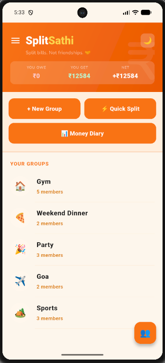
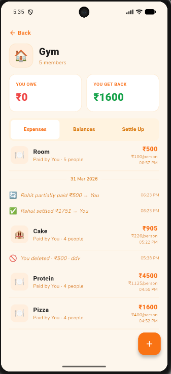
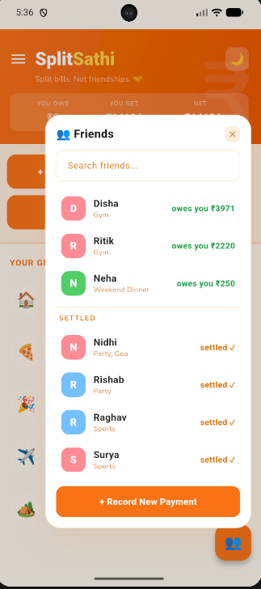
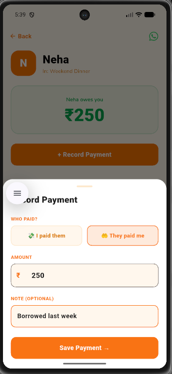

  <h1>🤝 SplitSathi</h1>
  
<i>Split bills. Not friendships. A beautiful, real-time expense-sharing app.</i>

  
  
  
  

 

## 📱 About The Project

SplitSathi is a full-stack, cross-platform mobile application designed to take the awkwardness out of sharing expenses with friends, roommates, or travel buddies. Built with a focus on UI/UX, the app features a pixel-perfect, animated interface and uses Firebase Firestore to calculate complex group debts in real-time.

### ✨ Key Features
* **Real-time Global Balances:** An autonomous background engine continuously polls Firebase to calculate optimized net balances across all groups and direct interactions.
* **Smart Settlement Algorithm:** Automatically simplifies debts within groups (e.g., if A owes B, and B owes C, A just owes C).
* **Deep-Linked Nudges:** Integrated with the WhatsApp API to dynamically generate context-aware reminder messages based on live database math.
* **Sleek UI/UX:** Features a custom bottom-sheet architecture, floating interactive panels, and edge-to-edge chat-style transaction histories.
* **Full Theme Support:** Gorgeous, animated transitions between Light and Dark mode.

---

## 📸 Screenshots

| Dashboard & Global Balances | Smart Group Expenses | Direct Friends Panel | Payment Bottom Sheet |
|:---:|:---:|:---:|:---:|
|  |  |  |  |

*(Note: Replace the image paths above with your actual uploaded screenshot names!)*

---

## 🛠️ Built With

* **Framework:** [Flutter](https://flutter.dev/)
* **Backend as a Service:** [Firebase Firestore](https://firebase.google.com/products/firestore) (NoSQL Database)
* **Authentication:** Firebase Auth
* **State Management:** Provider
* **Security:** `flutter_dotenv` for environment variable protection

---

## 🚀 Getting Started

To get a local copy up and running, kindly ping on lyingtreasure@gmail.com